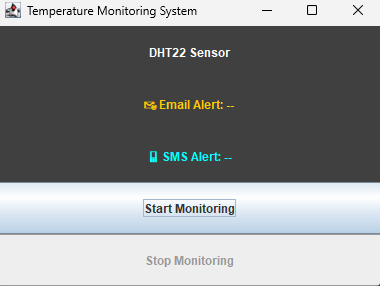
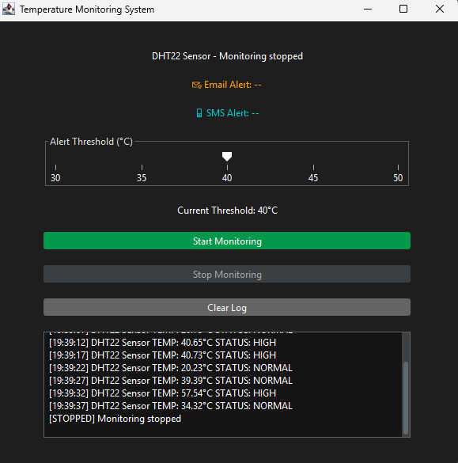

# 🌡️ Temperature Monitoring System

[](https://github.com/ImanDahliaa/TemperatureMonitoringSystem/actions/workflows/ant.yml)

A beginner-friendly Java Swing application that simulates temperature monitoring with alert messages and a modern dark theme.

## 🚀 Features
- Random temperature generation (20°C to 60°C)
- Email and SMS alerts for high temperature
- Auto-monitoring every 5 seconds (`Room`)
- FlatLaf dark theme for clean visuals

## 📸 Screenshots

### 🟢 Start Screen


### ✅ Normal Temperature


### 🔴 High Temperature


### 🚫 Stop Screen


## 🧪 How to Run
1. Open in NetBeans, IntelliJ, or Eclipse.
2. Run:
   - `projectUi.MainWindow`

## 📥 Download ZIP
To download the project as a ZIP file:
1. Go to the repository page on GitHub.
2. Click the green **Code** button.
3. Select **Download ZIP**.
4. Extract the ZIP file and open it in your IDE.

## 📦 Ant Setup
This project can be built with **Apache Ant** (using JDK 17).

1. Ensure you have Ant installed (`ant -version` to check).
2. Place the provided `build.xml` in the root of the project.
3. Build the project:
   ```bash
   ant clean
   ant jar

## 📁 Folder Structure
- **src/**
  - **projectOperation/**
    - Sensor.java  
    - TemperatureSensor.java  
    - AlertSystem.java  
    - EmailAlert.java  
    - SmsAlert.java  
    - Room.java  
  - **projectUi/**
    - MainWindow.java
    
## 🛠️ Technologies
- Java Swing
- FlatLaf (for dark theme)
- Git + GitHub

## 👨‍💻 Author

- **Name:** Iman Dahliaa
- **Location:** Perlis, Malaysia  
- **Education:** Bachelor of Electronics Engineering Technology
- **GitHub:** [Iman Dahliaa](https://github.com/ImanDahliaa)

## 📄 License
This project is for educational purposes.
