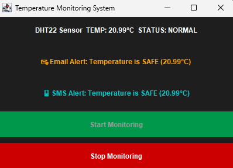
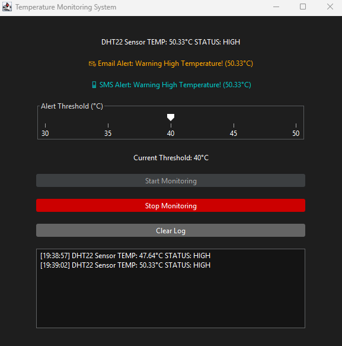

# 🌡️ Temperature Monitoring System

A beginner-friendly Java Swing application that simulates temperature monitoring with alert messages and a modern dark theme.

## 🚀 Features
- Random temperature generation (20°C to 60°C)
- Email and SMS alerts for high temperature
- Two UIs:
  - `MainWindow`: Manual temperature check
  - `Room`: Auto-monitoring every 5 seconds
- FlatLaf dark theme for clean visuals

## 📸 Screenshots

### ✅ Safe Temperature

### 🔥 High Temperature

## 🧪 How to Run
1. Open in NetBeans, IntelliJ, or Eclipse.
2. Run either:
   - `projectUi.MainWindow`
   - `projectOperation.Room`

## 📁 Folder Structure
src/
├─ 
projectOperation/
│  
├─ Sensor.java
│  
├─ TemperatureSensor.java
│  
├─ AlertSystem.java
│  
├─ EmailAlert.java
│  
├─ SmsAlert.java
│  
└─ Room.java
└─
projectUi/
└─
MainWindow.java

## 🛠️ Technologies
- Java Swing
- FlatLaf (for dark theme)
- Git + GitHub

## 👨‍💻 Author
- **Name:** Mohamad Iman
- **Location:** Perlis, Malaysia
- **GitHub:** [Iman Dahliaa](https://github.com/ImanDahliaa)

## 📄 License
This project is for educational purposes.
